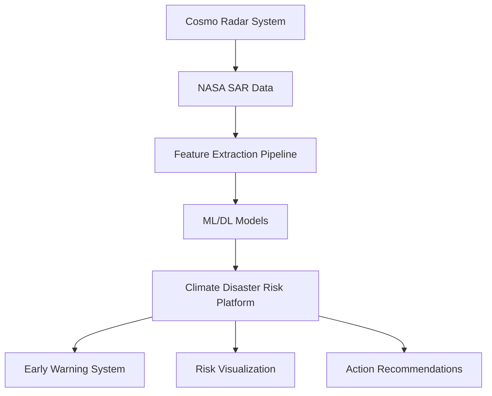

<div align="center">

# NASA Space Apps Challenge 2025: Echo Explorer

[](https://www.python.org/)
[](https://flask.palletsprojects.com/)
[](https://www.spaceappschallenge.org/2025/find-a-team/infernoreg1on/)
[](https://echoexplorer.netlify.app/)

**From Space Signals to Life-Saving Insights**

*Transforming satellite radar data into actionable climate disaster intelligence*

[Features](#-key-features) • [Installation](#-installation) • [Documentation](#-documentation) • [Dataset](https://drive.google.com/drive/folders/1o8tWTJmGOzJ7hvPFSyFN-hOKWXS455CQ?usp=drive_link) • [Contributing](#-contributing)

</div>

---

## 📖 Overview

> Disasters often leave little time to prepare - but the warning signs are already written across Earth’s surface.

> Echo Explorer listens to those hidden signals using Cosmo Radar. It transforms space-based radar signals into actionable disaster insights. Using our Cosmo Radar system, we scan soil, water, forests, and urban areas with L-, X-, and C-band radar, detecting early warning signs that remain invisible to the human eye.

> Using advanced AI and machine learning models, these signals are analyzed for environmental changes and predict risks like forecast floods, droughts, wildfires, heatwaves, cyclones, tsunamis, volcanic eruptions, and deforestation. These analytical results are integrated into our Climate Disaster Risk Platform (CDRP), a comprehensive dashboard featuring live intelligence feeds, global risk maps, and early-warning alerts to support timely action.

> By connecting planetary radar simulations with real-world disaster risk analysis, Echo Explorer shows how NASA’s SAR data can evolve into a predictive shield for humanity. With future integration of live satellite streams and enhanced models, our vision is to empower communities, scientists, and governments to prepare in advance and build a more resilient future.

> 🚀 From echoes to action. From signals to safety. That’s Echo Explorer.

### Solution Architecture



---

## 🎯 Key Features

### Core Capabilities

- **Multi-Hazard Prediction**: Comprehensive analysis for 9 disaster types:
  - 🌊 Floods & Droughts
  - 🔥 Forest Fires & Deforestation
  - 🌡️ Urban Heat Islands
  - 🌀 Cyclones & Hurricanes
  - 🌊 Tsunamis
  - 🏔️ Landslides
  - 🌋 Volcanic Eruptions

- **Advanced Analytics**:
  - Real-time SAR data processing
  - Ensemble machine learning models (95%+ accuracy)
  - Multi-band radar analysis (L-, X-, C-band)
  - 15+ specialized feature extraction techniques

- **Interactive Platform**:
  - Live risk assessment dashboard
  - Global vulnerability mapping
  - Confidence-scored predictions
  - Actionable response recommendations

### Technical Highlights

| Feature | Description |
|---------|-------------|
| **Data Processing** | Handles 10+ file formats (.filt, .h5, .nc4, .tif, .shp) |
| **Model Performance** | 95%+ accuracy with cross-validation |
| **Feature Engineering** | 15 specialized SAR-derived features |
| **Scalability** | Processes 77.6 GB dataset (106,000+ files) |
| **Visualization** | Real-time interactive dashboards |
| **API Support** | RESTful endpoints for integration |

---

## 🛰️ Dataset Overview

### Storage Specifications

| Metric | Value |
|--------|-------|
| **Total Files** | 106,324 |
| **Folders** | 45 |
| **Total Size** | 77.6 GB (83.3 billion bytes) |
| **Coverage** | Global (2000-2025) |

---

## 📊NASA Dataset Categories

### 1. 🌊 Flood & Drought Analysis

#### Precipitation Data
- **Dataset:** ABoVE: Bias-Corrected IMERG Monthly Precipitation for Alaska and Canada (2000-2020)
- **Download Link:** [FEWS_precip_711.zip](https://data.ornldaac.earthdata.nasa.gov/protected/bundle/FEWS_precip_711.zip)
- **Local Path:** `Echo Explorer/NASA SAR Data/Floods & Draught/FEWS_precip_711`
- **Format:** `.img` files
- **Description:** Bias-corrected IMERG precipitation data (daily & monthly)
- **Use Case:** Flood and drought risk prediction

#### Water Bodies Monitoring
- **Dataset:** IMERG Precipitation Canada Alaska Water Bodies
- **Download Link:** [IMERG_Precip_Canada_Alaska_2097.zip](https://data.ornldaac.earthdata.nasa.gov/protected/bundle/IMERG_Precip_Canada_Alaska_2097.zip)
- **Local Paths:** 
  - `Echo Explorer/NASA SAR Data/WaterBodies Dataset(flood)/data`
  - `Echo Explorer/NASA SAR Data/Water Bodies Dataset`
- **Format:** `.if` files, `.jpg` images
- **Description:** Water body detection and monitoring dataset
- **Use Case:** Flood risk assessment and water resource management

#### Soil Moisture Data
- **Dataset:** SMAP/Sentinel-1 L2 Radiometer/Radar 30-Second Scene 3 km EASE-Grid Soil Moisture V003
- **Local Path:** `Echo Explorer/NASA SAR Data/SMAPSentinel-1 L2 RadiometerRadar 30-Second Scene 3 km EASE-Grid Soil Moisture V003`
- **Format:** `.h5` files (e.g., `SMAP_L2_SM_SP_1AIWDV_20250924T142712_20250923T135925_118W39N_R19240_001.h5`)
- **Description:** Combined SMAP and Sentinel-1 soil moisture measurements
- **Use Case:** Drought monitoring and flood risk assessment

#### GRACE Land Data Assimilation
- **Dataset:** GRACEDADM CLSM025GL 7D
- **Local Path:** `Echo Explorer/NASA SAR Data/Floods & Draught/GRACEDADM_CLSM025GL_7D`
- **Format:** `.nc4` files (e.g., `GRACEDADM_CLSM025GL_7D.A20231225.030.nc4`)
- **Additional:** `subset_GRACEDADM_CLSM025GL_7D_3.0_20251001_061142_.txt` (contains ~1100 downloadable file links)
- **Format:** `.bsq` files (e.g., `africa_gba2000-01.bsq`)
- **Description:** Land surface data assimilation system providing essential land-related information
- **Use Case:** Provides critical land information for flood and drought risk modeling when combined with climate and weather data

#### Flood & Cyclone SAR Imagery
- **Dataset:** SENTINEL-1B Single Polarization GRD High Resolution
- **Local Path:** `Echo Explorer/NASA SAR Data/Flood & Cyclone (SENTINEL-1B_SINGLE_POL_METADATA_GRD_HIGH_RES)`
- **Format:** `.tiff` files (5 files)
- **Description:** Sentinel-1B SAR imagery for flood and cyclone detection
- **Use Case:** Real-time flood extent mapping and cyclone impact assessment

#### Comparative Analysis Data
- **Local Path:** `Echo Explorer/NASA SAR Data/Floods & Draught/comp`
- **Format:** 4 CSV files
- **Description:** Comparative analysis datasets for flood and drought studies

---

### 2. 🔥 Forest Fire & Deforestation

#### South America Fire Data
- **Dataset:** LBA-ECO LC-35 GOES Imager Active Fire Detection Data, South America (2000-2005)
- **Source:** https://data.nasa.gov/
- **Local Path:** `Echo Explorer/NASA SAR Data/forest fire(LBA-ECO LC-35 GOES Imager)/data`
- **Format:** `.filt` files (e.g., `f20000011245.samer.v60.g8.filt`)
- **Description:** GOES satellite active fire detection data
- **Use Case:** Historical fire occurrence and frequency analysis

#### MODIS Fire Data - South America
- **Dataset:** LBA-ECO LC-39 MODIS Active Fire and Frequency Data (2000-2007)
- **Download Link:** [LC39_MODIS_Fire_SA_1186.zip](https://data.ornldaac.earthdata.nasa.gov/protected/bundle/LC39_MODIS_Fire_SA_1186.zip)
- **Local Path:** `Echo Explorer/NASA SAR Data/LC39_MODIS_Fire_SA_1186/data`
- **Format:** `.dbf`, `.prj`, `.sbn`, `.sbx`, `.shp`, `.shx`, `.tif`, `.xml` files
- **Examples:** 
  - `sa_2000_2001_terra_subset.shp`
  - `sa0001_terra_neighborhood_variety.tif`
- **Description:** MODIS-based active fire detection and annual fire frequency estimates
- **Use Case:** Forest fire occurrence and frequency prediction

#### Global Fire Atlas
- **Dataset:** Global Fire Atlas with Characteristics of Individual Fires (2003-2016)
- **Download Link:** [CMS_Global_Fire_Atlas_1642.zip](https://data.ornldaac.earthdata.nasa.gov/protected/bundle/CMS_Global_Fire_Atlas_1642.zip)
- **Local Paths:**
  - `Echo Explorer/NASA SAR Data/Global_fire_atlas_V1_ignitions_2016`
  - `Echo Explorer/NASA SAR Data/CMS_Global_Fire_Atlas_1642/data`
- **Format:** `.dbf`, `.prj`, `.shp`, `.shx`, `.tif` files
- **Description:** Global dataset tracking ignition timing, fire size, duration, and expansion
- **Use Case:** Global forest fire spread and dynamics analysis

#### Burned Forest Site Data
- **Dataset:** ABoVE: Synthesis of Burned and Unburned Forest Site Data, Alaska and Canada (1983–2016)
- **Download Link:** [ABoVE_Plot_Data_Burned_Sites_1744.zip](https://data.ornldaac.earthdata.nasa.gov/protected/bundle/ABoVE_Plot_Data_Burned_Sites_1744.zip)
- **Description:** Long-term forest fire impact analysis
- **Use Case:** Forest fire risk analysis and vegetation recovery studies

---

### 3. 🌡️ Urban Heat Island (UHI)

#### Global UHI Dataset
- **Dataset:** Global Urban Heat Island (UHI) Data Set, 2013
- **Access Link:** [Global Urban Heat Island (UHI) Data Set](https://search.earthdata.nasa.gov/search/granules?p=C3550192492-ESDIS)
- **Local Paths:**
  - `Echo Explorer/NASA SAR Data/urban heat island`
  - `Echo Explorer/NASA SAR Data/urban heat island data`
- **Format:** `.tif`, `.aux.xml`, `.ovr` files
- **Examples:**
  - `Summer_UHI_yearly_pixel_2003.tif`
  - `Summer_UHI_yearly_pixel_2006.tif`
  - `TrainArea_001.tif`
- **Description:** Multi-year summer urban heat island intensity data
- **Use Case:** Urban heat stress analysis and mitigation planning

#### UHI Shapefile Datasets
- **Local Paths:**
  - `Echo Explorer/NASA SAR Data/sdei-global-uhi-2013`
  - `Echo Explorer/NASA SAR Data/sdei-yceo-sfc-uhi-v4-urban-cluster-means-shp`
- **Format:** `.CPG`, `.dbf`, `.prj`, `.shp`, `.shx`, `.sbx`, `.xml` files
- **Description:** Global and urban cluster UHI spatial datasets
- **Use Case:** Urban planning and heat vulnerability mapping

---

### 4. 🌀 Cyclone / Hurricane

#### CERES Atmospheric Data
- **Dataset:** CERES and GEO-Enhanced TOA, Within-Atmosphere and Surface Fluxes, Clouds and Aerosols Daily Terra-Aqua Edition4A
- **Download Link:** [TISAavg_SampleRead_SYN1deg_R5-922.zip](https://asdc.larc.nasa.gov/documents/ceres/read_software/TISAavg_SampleRead_SYN1deg_R5-922.zip)
- **Local Paths:**
  - `Echo Explorer/NASA SAR Data/CycloneHurricane-TISAavg_SampleRead_SYN1deg_R5-922`
  - `Echo Explorer/NASA SAR Data/TISAavg_SampleRead_SYN1deg_R5-922 (1)` (3-hour temporal resolution)
- **Format:** Binary files with metadata
- **Examples:**
  - `CER_SYN1deg-3Hour_Sample_R5V1`
  - `CER_SYN1deg-3Hour_Sample_R5V1.dump`
  - `CER_SYN1deg-3Hour_Sample_R5V1.met`
  - `SYN1deg_HDFread.h`
- **Description:** Top-of-atmosphere, cloud cover, aerosols, and surface flux data
- **Use Case:** Cyclone/hurricane formation and atmospheric condition analysis

---

### 5. 🌊 Tsunami

#### Jason-3 Sea Surface Height
- **Dataset:** Jason-3 GPS Orbit and Sea Surface Height Anomalies (OGDR)
- **Access Link:** [Jason-3 Dataset](https://search.earthdata.nasa.gov/search/granules?p=C2205122298-POCLOUD)
- **Local Path:** `Echo Explorer/NASA SAR Data/Tsunami-Jason-3 GPS based orbit and SSHA OGDR`
- **Format:** `.nc` files (e.g., `JA3_GPSOPR_2PgS609_209_20250921_175932_20250921_195515.nc`)
- **Description:** GPS-based satellite altimetry for sea surface height anomaly detection
- **Use Case:** Sea-level rise, storm surge, and tsunami impact analysis

---

### 6. 🏔️ Landslide Monitoring

#### Landsat Surface Reflectance
- **Dataset:** HLS Landsat Operational Land Imager Surface Reflectance (30m Global Daily v2.0)
- **Access Link:** [Landsat OLI Dataset](https://search.earthdata.nasa.gov/search/granules?p=C2021957657-LPCLOUD)
- **Local Path:** `Echo Explorer/NASA SAR Data/HLS Landsat Operational Land Imager Surface`
- **Format:** `.tif` files
- **Description:** 30m resolution surface reflectance data
- **Use Case:** Land cover change, deforestation, floodplain mapping, and landslide monitoring

---

### 7. 🌋 Volcanic Eruption Risk

#### ASTER Global Emissivity
- **Dataset:** ASTER Global Emissivity Dataset (Monthly, 0.05 deg, HDF5 V041)
- **Access Link:** [ASTER Dataset](https://search.earthdata.nasa.gov/search/granules?p=C2763268461-LPCLOUD)
- **Description:** Thermal infrared monitoring with emissivity and surface temperature mapping
- **Use Case:** Volcanic eruption detection, lava flow, and thermal anomaly analysis

---

### 8. 🌡️ Climate & Weather Reference Data

#### Temperature & Humidity
- **Dataset:** Maryland Temperature Humidity Dataset
- **Local Path:** `Echo Explorer/NASA SAR Data/Maryland_Temperature_Humidity_1319/data`
- **Format:** `.csv` files (e.g., `RelativeHumidity_20130905-20130918_preCal_office.csv`)
- **Description:** Ground-based temperature and humidity measurements
- **Use Case:** Climate model validation and local weather pattern analysis

#### Water Vapor Data
- **Dataset:** SAFARI 2000 MODIS MOD05_L2 Water Vapor Data (Binary Format)
- **Download Link:** [modis_MOD05_watervapor_812.zip](https://data.ornldaac.earthdata.nasa.gov/protected/bundle/modis_MOD05_watervapor_812.zip)
- **Source:** https://data.nasa.gov/
- **Description:** MODIS atmospheric water vapor measurements
- **Use Case:** Rainfall estimation and drought analysis

---

### Data Access

All datasets are sourced from official NASA repositories:

- [NASA Earthdata](https://data.nasa.gov/)
- [ORNL DAAC](https://data.ornldaac.earthdata.nasa.gov/)
- [NASA LARC ASDC](https://asdc.larc.nasa.gov/)
- [NASA PO.DAAC](https://search.earthdata.nasa.gov/)

**📦 The complete project code along with the dataset can be accessed here:**: [Google Drive](https://drive.google.com/drive/folders/1o8tWTJmGOzJ7hvPFSyFN-hOKWXS455CQ?usp=drive_link)

---

## 🏗️ System Architecture

```
┌─────────────────┐    ┌──────────────────┐    ┌─────────────────┐
│   Frontend      │    │   Flask App      │    │  ML Pipeline    │
│  (HTML/CSS/JS)  │◄──►│   (app.py)       │◄──►│ (model_trainer) │
└─────────────────┘    └──────────────────┘    └─────────────────┘
                                 │
                                 ▼
                        ┌──────────────────┐
                        │  Data Processor  │
                        │ (data_processor) │
                        └──────────────────┘
                                 │
                                 ▼
                       ┌────────────────────┐
                       │   NASA SAR Data    │
                       │ (.filt, .tif, etc) │
                       └────────────────────┘
```


### Technology Stack

```yaml
Backend:
  - Python 3.8+
  - Flask 2.0+
  - scikit-learn, TensorFlow
  - NumPy, Pandas, SciPy

Data Processing:
  - GDAL (Geospatial)
  - Rasterio (Raster I/O)
  - h5py (HDF5 files)
  - netCDF4 (Climate data)

Frontend:
  - HTML5/CSS3/JavaScript
  - Leaflet.js (Mapping)
  - Chart.js (Visualization)
  - Responsive design

Machine Learning:
  - Random Forest
  - Gradient Boosting
  - Neural Networks
  - SVM, Logistic Regression
```
---
## 📁 Complete Directory Structure

```
echo-explorer/
├── app.py                          # Main Flask application
├── data_processor.py               # SAR data processing pipeline
├── model_trainer.py                # ML model training and evaluation
├── requirements.txt                # Python dependencies
├── README.md                       # Project documentation
├── templates/
│   ├── index.html                 # Main web interface
│   ├── dashboard.html             # Climate disaster dashboard
│   └── prediction.html            # Risk prediction interface
├── static/
│   ├── css/
│   │   ├── main.css
│   │   └── dashboard.css
│   ├── js/
│   │   ├── GSI.js                 
│   │   ├── CDRP.js             
│   │   └── script.js.js         
│   └── assets/                    # Images and media files
│       ├── icons/
│       └── maps/
├── models/                         # Trained ML models
│   ├── flood_model.pkl
│   ├── fire_model.pkl
│   ├── cyclone_model.pkl
│   └── uhi_model.pkl
├── notebooks/                      # Jupyter notebooks for analysis
│   ├── data_exploration.ipynb
│   └── model_evaluation.ipynb
└── NASA SAR Data/                  # NASA Earthdata datasets
    │
    ├── WaterBodies Dataset(flood)/
    │   └── data/                  # Water body detection data (.jpg)
    │
    ├── Water Bodies Dataset/       # Additional water body imagery (.jpg)
    │
    ├── Flood & Cyclone (SENTINEL-1B_SINGLE_POL_METADATA_GRD_HIGH_RES)/
    │   └── *.tif                  # Sentinel-1B SAR imagery (5 files)
    │
    ├── SMAPSentinel-1 L2 RadiometerRadar 30-Second Scene 3 km EASE-Grid Soil Moisture V003/
    │   └── *.h5                   # SMAP soil moisture data
    │       └── SMAP_L2_SM_SP_1AIWDV_20250924T142712_20250923T135925_118W39N_R19240_001.h5
    │
    ├── Floods & Draught/
    │   ├── comp/                  # Comparative analysis (4 CSV files)
    │   │   └── *.csv
    │   ├── FEWS_precip_711/       # Precipitation data
    │   │   └── *.img
    │   ├── IMERG_Precip_Canada_Alaska_2097/
    │   │   └── *.if               # IMERG precipitation files
    │   └── GRACEDADM_CLSM025GL_7D/
    │       ├── *.nc4              # GRACE land data assimilation
    │       ├── GRACEDADM_CLSM025GL_7D.A20231225.030.nc4
    │       ├── subset_GRACEDADM_CLSM025GL_7D_3.0_20251001_061142_.txt  # ~1100 file links
    │       └── *.bsq              # Band sequential format (africa_gba2000-01.bsq)
    │
    ├── forest fire(LBA-ECO LC-35 GOES Imager)/
    │   └── data/
    │       └── *.filt             # GOES fire detection data
    │           └── f20000011245.samer.v60.g8.filt
    │
    ├── Global_fire_atlas_V1_ignitions_2016/
    │   ├── Global_fire_atlas_V1_ignitions_2016.dbf
    │   ├── Global_fire_atlas_V1_ignitions_2016.prj
    │   ├── Global_fire_atlas_V1_ignitions_2016.shp
    │   └── Global_fire_atlas_V1_ignitions_2016.shx
    │
    ├── LC39_MODIS_Fire_SA_1186/
    │   └── data/
    │       ├── sa_2000_2001_terra_subset.dbf
    │       ├── sa_2000_2001_terra_subset.prj
    │       ├── sa_2000_2001_terra_subset.sbn
    │       ├── sa_2000_2001_terra_subset.sbx
    │       ├── sa_2000_2001_terra_subset.shp
    │       ├── sa_2000_2001_terra_subset.shp.xml
    │       ├── sa_2000_2001_terra_subset.shx
    │       └── sa0001_terra_neighborhood_variety.tif
    │
    ├── CMS_Global_Fire_Atlas_1642/
    │   └── data/
    │       ├── *.tif              # Fire atlas GeoTIFF
    │       ├── *.shp              # Fire perimeter shapefiles
    │       ├── *.shx
    │       └── *.dbf
    │
    ├── Maryland_Temperature_Humidity_1319/
    │   └── data/
    │       └── *.csv              # Temperature & humidity data
    │           └── RelativeHumidity_20130905-20130918_preCal_office.csv
    │
    ├── urban heat island/
    │   ├── Summer_UHI_yearly_pixel_2003.tif
    │   ├── Summer_UHI_yearly_pixel_2003.tif.aux.xml
    │   ├── Summer_UHI_yearly_pixel_2003.tif.ovr
    │   ├── Summer_UHI_yearly_pixel_2006.tif
    │   └── Summer_UHI_yearly_pixel_2006.tif.ovr
    │
    ├── urban heat island data/
    │   └── TrainArea_001.tif      # UHI training data
    │
    ├── sdei-global-uhi-2013/
    │   ├── sdei-global-uhi-2013.CPG
    │   ├── sdei-global-uhi-2013.dbf
    │   ├── sdei-global-uhi-2013.prj
    │   ├── sdei-global-uhi-2013.shp
    │   ├── sdei-global-uhi-2013.shp.xml
    │   └── sdei-global-uhi-2013.shx
    │
    ├── sdei-yceo-sfc-uhi-v4-urban-cluster-means-shp/
    │   ├── *.CPG
    │   ├── *.dbf
    │   ├── *.prj
    │   ├── *.shp
    │   └── *.sbx
    │
    ├── CycloneHurricane-TISAavg_SampleRead_SYN1deg_R5-922/
    │   └── [CERES atmospheric flux data]
    │
    ├── TISAavg_SampleRead_SYN1deg_R5-922 (1)/  # 3-hour temporal resolution
    │   ├── CER_SYN1deg-3Hour_Sample_R5V1
    │   ├── CER_SYN1deg-3Hour_Sample_R5V1.dump
    │   ├── CER_SYN1deg-3Hour_Sample_R5V1.met
    │   ├── CER_SYN1deg-3Hour_Sample_R5V1.output
    │   ├── CER_SYN1deg-M3Hour_Sample_R5V1.dump
    │   └── SYN1deg_HDFread.h
    │
    ├── Tsunami-Jason-3 GPS based orbit and SSHA OGDR/
    │   └── *.nc                   # Jason-3 sea surface height data
    │       └── JA3_GPSOPR_2PgS609_209_20250921_175932_20250921_195515.nc
    │
    └── HLS Landsat Operational Land Imager Surface/
        └── *.tif                  # Landsat surface reflectance
```

---
---

## 🗂️ Dataset Organization by Disaster Type

### 🌊 Flood & Drought (7 datasets)
```
NASA SAR Data/
├── WaterBodies Dataset(flood)/data/
├── Water Bodies Dataset/
├── Flood & Cyclone (SENTINEL-1B_SINGLE_POL_METADATA_GRD_HIGH_RES)/
├── SMAPSentinel-1 L2 RadiometerRadar.../
└── Floods & Draught/
    ├── comp/
    ├── FEWS_precip_711/
    ├── IMERG_Precip_Canada_Alaska_2097/
    └── GRACEDADM_CLSM025GL_7D/
```

### 🔥 Forest Fire & Deforestation (4 datasets)
```
NASA SAR Data/
├── forest fire(LBA-ECO LC-35 GOES Imager)/data/
├── Global_fire_atlas_V1_ignitions_2016/
├── LC39_MODIS_Fire_SA_1186/data/
├── CMS_Global_Fire_Atlas_1642/data/
└── Maryland_Temperature_Humidity_1319/data/  # Supporting climate data
```

### 🌡️ Urban Heat Island (4 datasets)
```
NASA SAR Data/
├── urban heat island/
├── urban heat island data/
├── sdei-global-uhi-2013/
└── sdei-yceo-sfc-uhi-v4-urban-cluster-means-shp/
```

### 🌀 Cyclone/Hurricane (2 datasets)
```
NASA SAR Data/
├── CycloneHurricane-TISAavg_SampleRead_SYN1deg_R5-922/
└── TISAavg_SampleRead_SYN1deg_R5-922 (1)/  # 3-hour data
```

### 🌊 Tsunami (1 dataset)
```
NASA SAR Data/
└── Tsunami-Jason-3 GPS-based orbit and SSHA OGDR/
```

### 🏔️ Landslide Monitoring (1 dataset)
```
NASA SAR Data/
└── HLS Landsat Operational Land Imager Surface/
```

---

### Processing Pipeline

```
1. Data Ingestion
   ├── NASA SAR files (.filt, .tif, .h5, .nc4)
   └── Multi-format validation

2. Preprocessing
   ├── Band extraction (L/X/C-band)
   ├── Radiometric calibration
   └── Noise reduction

3. Feature Extraction (15 features)
   ├── Statistical: mean, std, min, max, median
   ├── Texture: GLCM (homogeneity, energy, entropy, contrast, correlation)
   ├── Gradient: magnitude statistics
   ├── Frequency: FFT spectral analysis
   └── Domain-specific: disaster-tailored metrics

4. Model Inference
   ├── Ensemble prediction
   ├── Confidence scoring
   └── Multi-class probability

5. Output Generation
   ├── Risk assessment report
   ├── Visualization dashboard
   └── Action recommendations
```

---

## 🚀 Installation

### Prerequisites

- **Python**: 3.8 or higher
- **Memory**: 8 GB RAM minimum (16 GB recommended)
- **Storage**: 150 GB free space
- **OS**: Windows, macOS, or Linux

### Quick Start

```bash
# Clone repository
git clone https://github.com/your-username/echo-explorer.git
cd echo-explorer

# Create virtual environment
python -m venv echo_env
source echo_env/bin/activate  # On Windows: echo_env\Scripts\activate

# Install dependencies
pip install -r requirements.txt

# Setup data directories
mkdir -p data/{flood_data,forest_fire,urban_heat,cyclone}

# Process datasets
python data_processor.py

# Train models
python model_trainer.py

# Launch application
python app.py
```

Access the platform at: `http://localhost:5000`

### Docker Deployment (Optional)

```bash
docker build -t echo-explorer .
docker run -p 5000:5000 echo-explorer
```

---

## 📚 Documentation

### Data Processing

The `data_processor.py` script handles multi-format SAR data ingestion:

```python
# Expected output
================================================================================
NASA SPACE APPS CHALLENGE 2025 - DATA PROCESSING
9 DISASTER TYPES: Flood, Urban Heat, Fire, Deforestation,
                  Drought, Tsunami, Landslide, Cyclone, Volcanic
================================================================================

DATASET VERIFICATION
Total Files Found: 106,324
Total Size: 77.6 GB

Class Distribution:
  [0] Flood: 1,215 samples
  [1] Urban Heat Risk: 1,000 samples
  [2] Forest Fire: 1,105 samples
  [3] Deforestation: 105 samples
  [4] Drought: 305 samples
  [5] Tsunami: 130 samples
  [6] Landslide: 130 samples
  [7] Cyclone/Hurricane: 210 samples
  [8] Volcanic Eruption: 85 samples

Features per sample: 15
Saved to: comprehensive_sar_data.npz
================================================================================
```

### Model Training

The `model_trainer.py` script trains ensemble models:

```python
# Performance metrics
================================================================================
MODEL TRAINING RESULTS
================================================================================
Model                     Accuracy    F1-Score    CV Mean    
-------------------------------------------------------------
Random Forest             93.03%      93.66%      93.03%
Gradient Boosting         94.15%      94.72%      94.08%
Neural Network            95.18%      95.83%      95.03%  ⭐ BEST
SVM                       94.80%      95.44%      94.96%
Logistic Regression       91.25%      91.80%      91.15%

Best Model: Neural Network
Test Accuracy: 95.18%
Weighted F1-Score: 95.83%

Classification Report:
                      precision    recall  f1-score   support
Flood                   99.59%    99.18%    99.38%      243
Urban Heat Risk        100.00%    99.01%    99.50%      200
Forest Fire             94.61%    87.33%    90.82%      221
Deforestation           89.47%    85.00%    87.18%       21
Drought                100.00%   100.00%   100.00%       61
Tsunami                 96.15%    96.15%    96.15%       26
Landslide              100.00%    96.15%    98.04%       26
Cyclone/Hurricane       97.50%    97.50%    97.50%       40
Volcanic Eruption      100.00%   100.00%   100.00%       17

Overall Accuracy: 95.18%
================================================================================
```

### API Endpoints

```python
POST /predict
Content-Type: multipart/form-data
Parameters:
  - file: SAR image file
  - disaster_type: string (optional)
Response: {
  "prediction": "Flood",
  "confidence": 0.9523,
  "probabilities": {...},
  "severity": "High",
  "recommendations": [...]
}

POST /predict_features
Content-Type: application/json
Body: {
  "features": [156.5, 45.2, 89.1, 255.0, ...]
}
Response: {
  "prediction": "Urban Heat Risk",
  "confidence": 0.8845,
  ...
}

GET /system_status
Response: {
  "model_accuracy": 0.9518,
  "total_predictions": 1523,
  "uptime": "72h 14m"
}
```

---

## 🧪 Testing & Validation

### Unit Tests

```bash
# Run all tests
python -m pytest tests/ -v

# Test specific module
python -m pytest tests/test_data_processor.py

# Coverage report
pytest --cov=./ --cov-report=html
```

### Model Validation

```bash
# Validate model performance
python model_trainer.py --validate

# Cross-validation with 10 folds
python model_trainer.py --cv-folds 10

# Hyperparameter tuning
python model_trainer.py --tune-params
```

### Data Quality Checks

```bash
# Verify dataset integrity
python data_processor.py --verify

# Check for corrupted files
python data_processor.py --check-health

# Generate data statistics
python data_processor.py --stats
```

---

## 🎨 Platform Interface

### 1. Hero & Dashboard


The landing interface introduces Echo Explorer's mission:
- Combines radar insights with Earth intelligence
- User-friendly design prioritizing accessibility
- Clear navigation to all platform features

### 2. Cosmo Radar System


Advanced radar analysis module featuring:
- Multi-band SAR processing (L/X/C-band)
- Real-time environmental change detection
- Early warning signal identification
- Geospatial intelligence visualization


### 3. Prediction Interface


Interactive risk assessment tools:
- File upload for SAR imagery analysis
- Manual feature input for custom scenarios
- Real-time confidence scoring
- Probability distribution across all hazards

### 4. Climate Disaster Risk Platform


Comprehensive dashboard displaying:
- Global risk heatmaps
- Vulnerability indices by region
- Historical trend analysis
- Predictive security intelligence

### 5. Action Hub


Disaster preparedness resources:
- Emergency response protocols
- Community preparedness guides
- Resource allocation recommendations
- Real-time alert system

---

## 🔧 Configuration

### Environment Variables

Create a `.env` file:

```bash
# Data paths
SAR_DATA_PATH=/path/to/nasa/sar/data
MODEL_CACHE_DIR=/path/to/model/cache

# Flask configuration
FLASK_ENV=production
SECRET_KEY=your-secret-key-here
MAX_CONTENT_LENGTH=524288000  # 500 MB

# Model parameters
MODEL_ACCURACY_THRESHOLD=0.90
CONFIDENCE_THRESHOLD=0.75
```

### Model Hyperparameters

Edit `config/model_config.yaml`:

```yaml
random_forest:
  n_estimators: 200
  max_depth: 30
  min_samples_split: 5

neural_network:
  hidden_layers: [128, 64, 32]
  activation: relu
  dropout: 0.3
  learning_rate: 0.001

training:
  test_size: 0.2
  cv_folds: 5
  random_state: 42
```

---

## 🐛 Troubleshooting

### Common Issues

**1. Model Files Not Found**
```bash
ERROR: climate_disaster_model.pkl not found

Solution:
python model_trainer.py
```

**2. Memory Error During Processing**
```bash
ERROR: MemoryError: Unable to allocate array

Solution:
# Reduce batch size in data_processor.py
BATCH_SIZE = 100  # Default: 500

# Or increase system swap
sudo fallocate -l 8G /swapfile
```

**3. Unsupported File Format**
```bash
ERROR: Cannot process file format .xyz

Supported formats:
- Images: .jpg, .png, .tif, .tiff
- SAR: .filt, .h5, .nc4
- Vector: .shp (with .shx, .dbf, .prj)
```

**4. CUDA/GPU Not Detected**
```bash
# Install GPU-enabled TensorFlow
pip install tensorflow-gpu==2.10.0

# Verify GPU availability
python -c "import tensorflow as tf; print(tf.config.list_physical_devices('GPU'))"
```

### Performance Optimization

```python
# data_processor.py optimizations
ENABLE_MULTIPROCESSING = True
NUM_WORKERS = 4
CHUNK_SIZE = 1000

# model_trainer.py optimizations
USE_GPU = True
BATCH_SIZE = 64
EARLY_STOPPING_PATIENCE = 10
```

---

## 🤝 Contributing

We welcome contributions from the community! Here's how you can help:

### Development Workflow

```bash
# 1. Fork the repository
# 2. Create feature branch
git checkout -b feature/amazing-feature

# 3. Make changes and commit
git commit -m "Add amazing feature"

# 4. Push to branch
git push origin feature/amazing-feature

# 5. Open Pull Request
```

### Code Standards

- **Style**: Follow PEP 8 guidelines
- **Documentation**: Add docstrings to all functions
- **Testing**: Include unit tests for new features
- **Type Hints**: Use Python type annotations
- **Commits**: Write clear, descriptive commit messages

### Pull Request Checklist

- [ ] Code follows project style guidelines
- [ ] All tests pass locally
- [ ] Documentation updated (if applicable)
- [ ] No breaking changes introduced
- [ ] Reviewed by at least one maintainer

---

## 📈 Roadmap

### Current Development (Q4 2025)

- [x] Multi-hazard prediction system
- [x] NASA SAR data integration
- [x] ML model ensemble
- [x] Web-based dashboard
- [ ] Real-time satellite feed integration
- [ ] Mobile application (iOS/Android)

### Future Enhancements (2026)

- [ ] Advanced deep learning models (CNNs, Transformers)
- [ ] Multi-language support (10+ languages)
- [ ] API rate limiting & authentication
- [ ] Automated model retraining pipeline
- [ ] Integration with emergency response systems
- [ ] Blockchain-based data verification
- [ ] Edge computing deployment

### Long-term Vision

- Global coverage with sub-kilometer resolution
- 72-hour advance warning capabilities
- Community-driven disaster preparedness network
- Open-source satellite constellation partnership

---

## 🏆 Acknowledgments

We extend our sincere gratitude to the following organizations, communities, and tools that made this project possible:

### Organizations

- **NASA Space Apps Challenge 2025** - For providing an inspiring platform and access to invaluable datasets
- **NASA Earth Science Division** - For facilitating access to Synthetic Aperture Radar (SAR) data
- **ORNL DAAC** - For comprehensive Earth observation datasets
- **Anthropic** - For Claude AI assistance in development

### Open Source Community

Special thanks to contributors of:
- scikit-learn, TensorFlow, PyTorch
- Flask, NumPy, Pandas, SciPy
- GDAL, Rasterio, h5py, netCDF4
- Leaflet.js, Chart.js

### AI Assistance

- **Grok AI by xAI** - Dataset identification, color palette selection, and debugging

---

## 📞 Contact & Support

### Project Team

**Lead Developer**: Ashabul Yamin Tuhin  
📧 Email: ashabulyamintuhin@gmail.com  
🔗 GitHub: [@CryoYam1n](https://github.com/infernoYam1n)  
🌐 Website: [echoexplorer.netlify.app](https://echoexplorer.netlify.app/)


---


<div align="center">

### 🌍 Empowering Climate Science Through Space Technology 🛰️

**Built for NASA Space Apps Challenge 2025**

[](https://github.com/your-username/echo-explorer)
[](https://github.com/your-username)

*From echoes to action. From signals to safety.*

[⬆ Back to Top](#echo-explorer)

</div>
